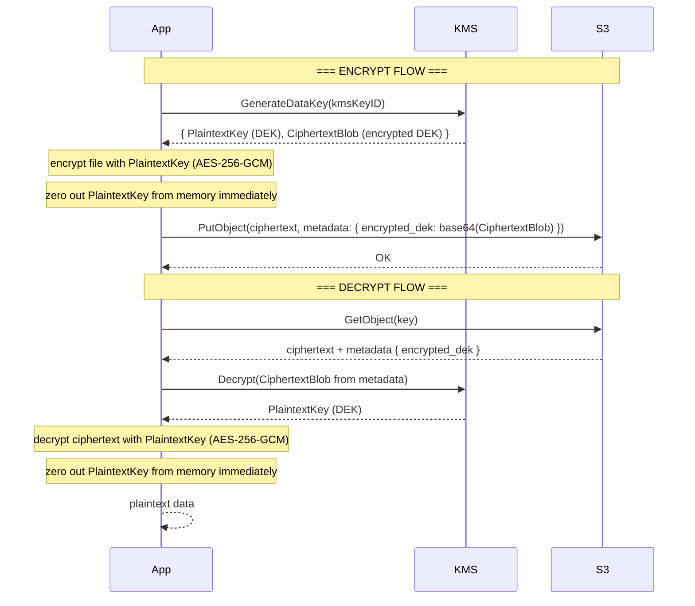

# Kata: Envelope Encryption

> **Provider:** AWS only — ต้องการ AWS account, IAM permissions สำหรับ KMS, และ AWS SDK

## Context

การเข้ารหัสไฟล์ก่อน upload ด้วย key ที่เก็บไว้ใน environment variable ดูเหมือนจะปลอดภัย แต่มีปัญหาสำคัญสองอย่าง: key อยู่ใน plaintext ในระบบ config และเมื่อถึงเวลา rotate key ต้องโหลดและ re-encrypt ไฟล์ทุกไฟล์ใหม่ทั้งหมด
Envelope Encryption แก้ปัญหานี้โดยแยก key ออกเป็นสองชั้น: DEK (Data Encryption Key) เป็น random key ที่ใช้เข้ารหัสไฟล์แต่ละไฟล์ และ KEK (Key Encryption Key) ที่เก็บใน KMS ใช้เข้ารหัส DEK อีกชั้น
เมื่อ rotate KEK แค่ต้อง re-encrypt DEK (ข้อมูลเล็กๆ) ไม่ต้องแตะไฟล์จริงเลย — และ KMS ไม่เคยเห็น plaintext data ของคุณ

## Real World Incidents

**Incident 1 — Key rotation ทำให้ระบบดาวน์ 3 วัน (Healthcare provider, 2021)**
บริษัทด้านสุขภาพเก็บ medical record เข้ารหัสด้วย single master key ที่เก็บใน config server
เมื่อถึงรอบ annual key rotation ตาม HIPAA requirement ทีมต้องโหลดและ re-encrypt medical record ทั้งหมด 8TB ข้ามคืน
process ใช้เวลา 72 ชั่วโมง ระหว่างนั้น system อยู่ใน partial state — record บางส่วนยังเข้ารหัสด้วย old key บางส่วนด้วย new key
ทีม dev เขียน migration script ผิดพลาด ทำให้ record 200 ราย corrupt — ต้องกู้จาก backup และเสียเวลาเพิ่มอีก 2 วัน

**Incident 2 — Hardcoded encryption key พบใน git history (SaaS startup, 2022)**
Developer เขียน encryption key โดยตรงใน source code ระหว่าง prototype "ชั่วคราว" แล้วลืม rotate ออก
Security scan ของ CI pipeline ตรวจพบ key ใน git history หลังจาก repository ถูก set เป็น public โดยไม่ตั้งใจ
ทีมต้อง assume ว่า key ถูก compromise ทั้งหมด และต้อง re-encrypt ข้อมูลทั้งหมดใน production ด้วยความเร่งด่วน
ถ้าใช้ envelope encryption ตั้งแต่แรก จะต้อง revoke KMS key เก่าและ re-encrypt แค่ DEK — ไม่ใช่ข้อมูล gigabytes

## The Naive Way (และทำไมมันพัง)

**วิธีที่คนมักเขียนครั้งแรก:**
```go
// key มาจาก env var หรือ config file
key := []byte(os.Getenv("ENCRYPTION_KEY"))

block, _ := aes.NewCipher(key)
gcm, _ := cipher.NewGCM(block)
nonce := make([]byte, gcm.NonceSize())
rand.Read(nonce)

ciphertext := gcm.Seal(nonce, nonce, plaintext, nil)
// upload ciphertext ไปยัง S3
```

**พังตอนไหน:**
- ถึงเวลา rotate key ต้อง download, decrypt, re-encrypt, และ re-upload ทุกไฟล์ — อาจใช้เวลาหลายวัน
- Key ใน env var หรือ config อาจ leak ผ่าน log, crash dump, หรือ process listing (`/proc/<pid>/environ`)
- ใช้ key เดียวกันทุกไฟล์ — ถ้า key ถูก compromise ทุกไฟล์ถูก compromise พร้อมกัน
- ไม่มี audit trail ว่าใครใช้ key เมื่อไหร่

**Root cause:**
Key management และ data encryption ถูกผสมรวมกัน — เมื่อ key เปลี่ยน ทุกอย่างต้องเปลี่ยนตาม
Envelope encryption แยกสองหน้าที่นี้ออกจากกัน: KMS จัดการ key lifecycle, application จัดการแค่ data encryption

## Encrypt/Decrypt Flow



## Explore First

### Go

ก่อนเขียน code ให้เปิด AWS KMS SDK v2 docs แล้วตอบคำถามเหล่านี้ก่อน (ห้ามดู example)

- hint: `kms.GenerateDataKey` — parameter `KeySpec` รับค่าอะไรได้บ้าง? `AES_256` กับ `AES_128` ต่างกันยังไง? output มี field อะไรบ้าง?
- hint: `kms.GenerateDataKeyOutput` — field `Plaintext` กับ `CiphertextBlob` ต่างกันอย่างไร? อันไหนที่เราจะเก็บไว้ใน S3 metadata?
- hint: `kms.Decrypt` — input คืออะไร? ต้องส่ง `KeyId` ด้วยไหม หรือ KMS รู้จาก CiphertextBlob เองได้?
- hint: `cipher.NewGCM` — AEAD คืออะไร? `Seal` กับ `Open` ทำงานยังไง? nonce ต้องมีขนาดกี่ bytes?
- hint: S3 object metadata — ใช้ `s3.PutObjectInput.Metadata` (map[string]string) เก็บ encrypted DEK ได้ยังไง? มี size limit ไหม?
- hint: zeroing memory — หลัง decrypt DEK แล้วควรทำ `copy(plaintextKey, make([]byte, len(plaintextKey)))` หรือ `for i := range key { key[i] = 0 }` ทำไม?

## Task

เขียนสองฟังก์ชันสำหรับ envelope encryption workflow:

```go
// EncryptAndUpload เข้ารหัสไฟล์ด้วย envelope encryption แล้ว upload ไปยัง S3
// - สร้าง DEK ใหม่ต่อไฟล์ผ่าน KMS GenerateDataKey
// - เข้ารหัสไฟล์ด้วย DEK (AES-256-GCM)
// - เก็บ encrypted DEK ไว้ใน S3 object metadata
// - ลบ plaintext DEK จาก memory ทันทีหลังใช้งาน
func EncryptAndUpload(
    ctx context.Context,
    s3Client *s3.Client,
    kmsClient *kms.Client,
    bucket, key, kmsKeyID string,
    plaintext io.Reader,
) error

// DownloadAndDecrypt download object จาก S3 แล้ว decrypt ด้วย envelope decryption
// - ดึง encrypted DEK จาก S3 object metadata
// - ถอดรหัส DEK ผ่าน KMS Decrypt
// - ถอดรหัสไฟล์ด้วย DEK (AES-256-GCM)
// - ลบ plaintext DEK จาก memory ทันทีหลังใช้งาน
func DownloadAndDecrypt(
    ctx context.Context,
    s3Client *s3.Client,
    kmsClient *kms.Client,
    bucket, key string,
) (io.Reader, error)
```

## Requirements

- สร้าง DEK ใหม่ต่อไฟล์เสมอ — ห้ามใช้ DEK เดิมซ้ำข้ามไฟล์
- เก็บ encrypted DEK (CiphertextBlob) เป็น base64 ใน S3 object metadata ภายใต้ key `x-amz-meta-encrypted-dek`
- ใช้ AES-256-GCM สำหรับ file encryption — prepend nonce (12 bytes) ไว้หน้า ciphertext ใน S3 object
- ห้ามเก็บ plaintext DEK ที่ใดก็ตาม — ต้อง zero out memory หลังใช้งานทันที
- ถ้า S3 object ไม่มี metadata `encrypted-dek` ให้ return error ที่อธิบายชัดเจน
- ใช้ `crypto/rand` สำหรับสร้าง nonce — ห้ามใช้ `math/rand`

## Acceptance Criteria

- [ ] `EncryptAndUpload` upload object ที่มี metadata `x-amz-meta-encrypted-dek` ใน HeadObject response
- [ ] `DownloadAndDecrypt` return bytes ที่ตรงกับ original plaintext byte-for-byte
- [ ] ไฟล์ที่เก็บใน S3 ไม่ตรงกับ plaintext — เป็น ciphertext ที่อ่านไม่ออก
- [ ] encrypt/decrypt ไฟล์ 50MB ได้สำเร็จ
- [ ] encrypt ไฟล์เดียวกันสองครั้ง — ได้ ciphertext ต่างกันสองชุด (เพราะ DEK และ nonce ต่างกัน)
- [ ] `DownloadAndDecrypt` object ที่ไม่มี metadata ต้อง return error ที่อธิบาย root cause ชัดเจน
- [ ] ใช้ AWS X-Ray หรือ log ตรวจสอบได้ว่า KMS ถูก call เมื่อ encrypt และ decrypt แต่ละครั้ง

## Concepts Involved

- `DEK (Data Encryption Key)` — random symmetric key ที่ใช้เข้ารหัสข้อมูลจริง สร้างใหม่ต่อไฟล์
- `KEK (Key Encryption Key)` — key ที่ใช้เข้ารหัส DEK อีกชั้น ในที่นี้คือ KMS CMK
- `KMS GenerateDataKey` — AWS API ที่สร้าง DEK และ return ทั้ง plaintext และ encrypted version
- `AES-256-GCM` — authenticated encryption ที่ให้ทั้ง confidentiality และ integrity (detect tampering)
- `Nonce` — number used once, ต้องไม่ซ้ำกันต่อ (key, nonce) pair — random 12 bytes สำหรับ GCM
- `Memory zeroing` — ลบ sensitive data จาก memory เพื่อกัน memory dump หรือ GC artifact

## Production Reality

- **ใช้จริง:** AWS SDK มี S3 Encryption Client (`s3crypto`) ที่ implement envelope encryption ให้อัตโนมัติ ใช้ใน production แทนการเขียนเอง
- **ทำ manual เมื่อ:** ต้องการ compatibility กับ system อื่นที่ไม่ใช่ AWS SDK, หรือต้องการ custom metadata format
- **Key rotation:** เมื่อ rotate KMS key แค่ต้อง re-encrypt DEK (bytes เล็กๆ) ต่อ object — ไม่ต้อง download/re-encrypt ไฟล์จริงเลย
- **kata สอนว่า:** Envelope encryption แยก "ปัญหา key management" ออกจาก "ปัญหา data encryption" — KMS ไม่เคยเห็น plaintext data คุณ และคุณไม่ต้องจัดการ key lifecycle เอง
