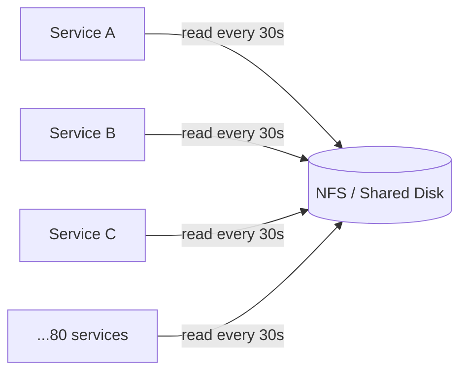

# System Design Kata: Config Distribution Service

## Context

ใน `01-whole-file-read` คุณเขียน `ReadConfig(path)` ที่อ่าน config ไฟล์ได้ถูกต้อง
ทีนี้ให้จินตนาการว่า service ของคุณ deploy สำเร็จ และกลายเป็น template ที่ทีมอื่นๆ copy ไปใช้

6 เดือนต่อมา — บริษัทมี 80 microservices แต่ละตัวใช้ `ReadConfig()` เหมือนกันทุกประการ
ทุกตัวอ่าน config จาก path เดียวกันบน shared NFS mount ทุก 30 วินาที

ตอนนี้คุณต้อง design ระบบที่จัดการ config ให้ services เหล่านี้ได้อย่างถูกต้องใน production

---

## Real World Incidents

**Incident 1 — NFS fd exhaustion (Uber, 2015)**
ระบบมี 200 services อ่าน config จาก NFS mount ทุก 30 วินาที
เมื่อ NFS server มีปัญหา ทุก service ค้างที่ `open()` syscall พร้อมกัน
kernel หมด fd ที่ใช้รอ → services อื่นที่ไม่เกี่ยวกับ config ก็ open file ไม่ได้ตาม
ผล: cascading failure ทั่วทั้ง cluster จาก config read ที่ timeout

**Incident 2 — Config update ไม่ถึง production (DoorDash, 2021)**
ทีม ops อัพเดต feature flag ใน config file
services บางตัว reload ทัน บางตัวยังใช้ cache เก่าอยู่
ระบบ A เห็น flag = true, ระบบ B เห็น flag = false พร้อมกัน
เกิด split-brain: order ถูกส่งไปยัง service ที่ process logic ต่างกัน
ผล: duplicate charges ให้ลูกค้า 40 นาทีก่อนจะตรวจพบ

**Incident 3 — Config hotspot ทำให้ deploy ช้า (Netflix, blog)**
ทุก service อ่าน config จาก central server โดยตรง
ตอน deploy wave ใหม่ (services restart พร้อมกัน 200 instances)
config server รับ request spike ทันที → latency พุ่ง → services timeout → retry loop
ผล: deploy ที่ควรใช้ 5 นาทีใช้เวลา 45 นาที และบาง service start ไม่ขึ้น

---

## The Naive Design (และทำไมมันพัง)

ทุก service อ่าน config จาก shared location ตรงๆ ทุก 30 วินาที:



**พังตอนไหน:**
- NFS ช้าหรือ down → ทุก service ค้างพร้อมกัน (ไม่มี fallback)
- Config อัพเดต → ไม่รู้ว่า service ไหน reload ทันบ้าง (no visibility)
- Deploy wave → 80 services restart พร้อมกัน → NFS spike
- ขยาย services → read load เพิ่มเป็น O(n) ต่อ config update cycle

---

## Task

ออกแบบ Config Distribution Service ที่แทนที่ direct NFS read
ให้ 80 microservices รับ config ได้อย่างถูกต้องและ reliable

คุณต้อง:
1. วาด architecture diagram แสดง components และ data flow
2. อธิบาย Key Decisions ว่าทำไมถึงเลือก design นั้น

---

## Constraints

- **Services:** 80 microservices, แต่ละตัวต้องการ config เวอร์ชันปัจจุบัน
- **Update propagation:** config ที่อัพเดตต้องถึงทุก service ภายใน 60 วินาที
- **Stale tolerance:** รับได้ถ้า service เห็น config เก่าไม่เกิน 60 วินาที
- **Availability:** ถ้า config service down ชั่วคราว services ต้องยังทำงานได้
- **Consistency:** ห้ามเกิด split-brain — services ไม่ควรเห็น config ต่างเวอร์ชันกันนานเกิน 60 วินาที
- **Scale target:** รองรับ 500 services โดยไม่ต้อง redesign core architecture

---

## What to Submit

**1. Diagram (image)**
วาด architecture ที่แสดง:
- Components ทั้งหมด (boxes)
- Data flow ระหว่าง components (arrows + label ว่า push หรือ pull)
- จุดที่ config เข้าระบบ (ops/admin) และออกไปถึง service

**2. Key Decisions (text — required)**

```
## Key Decisions
- เลือก push หรือ pull model เพราะ: ...
- จัดการ "service down ตอน config update" ยังไง: ...
- ป้องกัน spike ตอน deploy wave ยังไง: ...
- ถ้า config service เองล่ม services จะทำอะไร: ...

## Assumptions
- config file ขนาด: ...
- update frequency: ...
- อื่นๆ: ...
```

---

## Acceptance Criteria

- [ ] ไม่มี direct read จาก shared disk ในทุก service — มี abstraction layer กั้น
- [ ] ถ้า config service down ชั่วคราว services ยังทำงานได้โดยใช้ config ล่าสุดที่รู้จัก
- [ ] config update ถึงทุก services ภายใน 60 วินาที — อธิบาย mechanism ที่รับประกันได้
- [ ] ไม่เกิด request spike บน config source เมื่อ 80 services restart พร้อมกัน
- [ ] อธิบาย trade-off ระหว่าง push vs pull สำหรับ use case นี้ได้
- [ ] ระบุได้ว่า component ไหนคือ single point of failure และมีแผนรับมือยังไง

---

## Concepts Involved

- `push-vs-pull` — การเลือก model กระทบ latency, load, complexity ยังไง
- `fd-lifecycle` — ทำไม direct file read ใน distributed setting ถึงอันตราย → `shared/concepts/fd-lifecycle.md`
- `fan-out` — config update 1 ครั้งต้องส่งถึง 80 services — bottleneck อยู่ที่ไหน
- `local-cache` — tradeoff ระหว่าง freshness กับ availability ตอน upstream ล่ม
