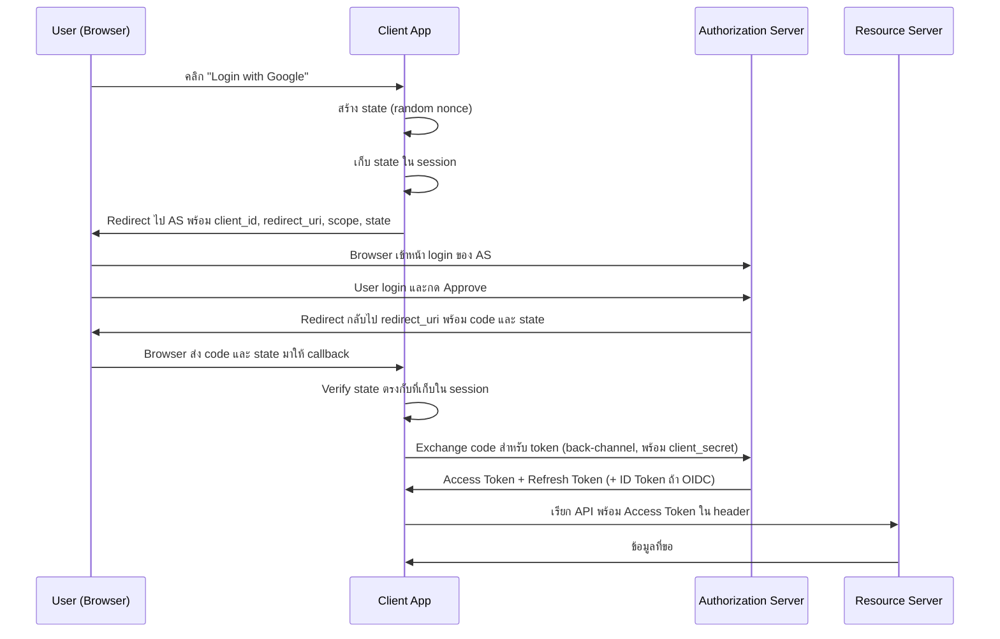
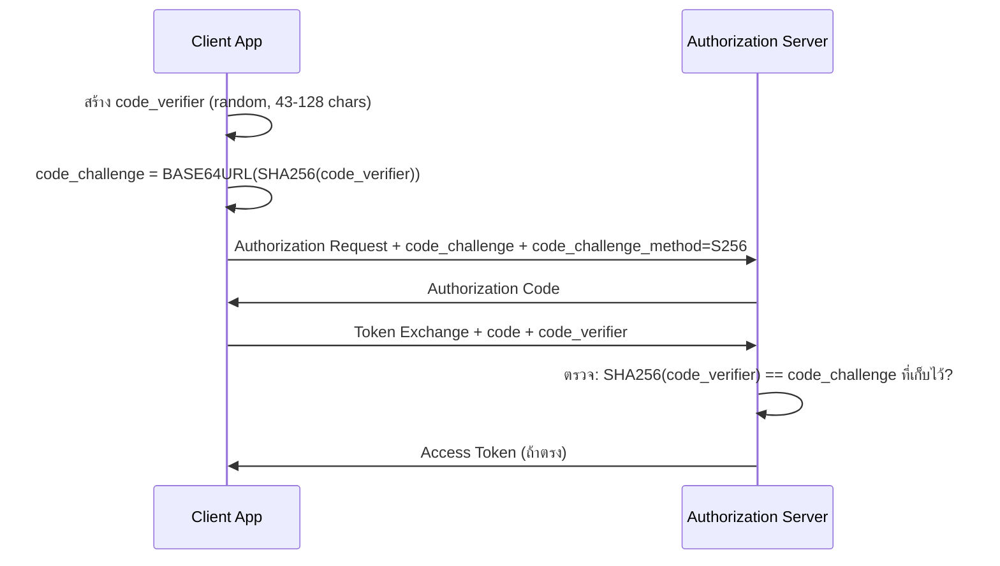

# Concept: OAuth2

## OAuth2 คืออะไร

OAuth2 (RFC 6749) เป็น authorization framework ที่ให้ third-party application ขอ access ทรัพยากรของ user โดยไม่ต้องรู้ password ของ user
ตัวอย่างในชีวิตจริง: Figma ขอ access Google Drive ของเรา — เราไม่ได้ให้ password Google กับ Figma แต่ Google ออก token ให้ Figma ใช้แทน

**สิ่งสำคัญ:** OAuth2 เป็น authorization (สิทธิ์ทำอะไรได้บ้าง) ไม่ใช่ authentication (พิสูจน์ว่าเป็นใคร)
การใช้ OAuth2 สำหรับ "Login with Google" ต้องเพิ่ม OpenID Connect (OIDC) layer ด้านบน

## OAuth2 Roles

มี 4 roles ใน OAuth2 spec:

| Role | คือใคร | ตัวอย่าง |
|------|--------|----------|
| **Resource Owner** | user ที่เป็นเจ้าของข้อมูล | เราที่เป็นเจ้าของ Google Drive |
| **Client** | แอพที่ขอ access | Figma |
| **Authorization Server** | ออก token | Google OAuth server (`accounts.google.com`) |
| **Resource Server** | เก็บข้อมูลจริง | Google Drive API |

ในกรณีของ Google — Authorization Server กับ Resource Server อยู่กับ Google ทั้งคู่
แต่ในระบบ enterprise — อาจมี auth server กลาง (เช่น Keycloak) ที่แยกจาก API server

## Grant Types — เลือกแบบไหน

### Authorization Code (สำหรับ web app และ mobile app)

ใช้เมื่อ: มี server-side component หรือเป็น mobile app
เหมาะกับ: web application, mobile app (ต้องใช้ PKCE ด้วย)

```
User → Client → Authorization Server → User กด Approve → Authorization Server → Client (พร้อม code) → Client exchange code → Token
```

authorization code อายุสั้น (มักไม่กี่นาที) และใช้ได้ครั้งเดียว
แลกเป็น access token ผ่าน back-channel (server-to-server) ที่ไม่เห็นใน browser history

### Client Credentials (สำหรับ service-to-service)

ใช้เมื่อ: ไม่มี user involved — machine-to-machine
เหมาะกับ: background jobs, microservices, API integrations

```
Service A → Authorization Server (พร้อม client_id + client_secret) → Access Token → Service B
```

ไม่มี user redirect ไม่มี user consent — แค่ client เอา secret ไปแลก token เอง

### Implicit (Deprecated — ห้ามใช้)

เคยออกแบบสำหรับ SPA (Single Page Application) ที่ไม่มี backend
ส่ง access token กลับมาใน URL fragment (`#access_token=...`) โดยตรง — ไม่มี authorization code

**ทำไม deprecated:** token อยู่ใน URL → browser history, referer header, log file เห็นได้ทั้งหมด
**ใช้แทน:** Authorization Code + PKCE แทน Implicit ใน SPA ทุกกรณี

## Authorization Code Flow — Step by Step



**URL ที่ Client สร้างในขั้นตอนแรก:**
```
https://accounts.google.com/o/oauth2/auth
  ?response_type=code
  &client_id=YOUR_CLIENT_ID
  &redirect_uri=https://yourapp.com/callback
  &scope=email%20profile
  &state=RANDOM_NONCE_HERE
```

**Token Exchange Request (back-channel):**
```http
POST https://oauth2.googleapis.com/token
Content-Type: application/x-www-form-urlencoded

grant_type=authorization_code
&code=AUTHORIZATION_CODE
&redirect_uri=https://yourapp.com/callback
&client_id=YOUR_CLIENT_ID
&client_secret=YOUR_CLIENT_SECRET
```

## PKCE — Proof Key for Code Exchange (RFC 7636)

### ปัญหาที่ PKCE แก้

Authorization Code flow ปกติต้องใช้ `client_secret` ในการแลก token
mobile app และ SPA เก็บ `client_secret` อย่างปลอดภัยไม่ได้ (user สามารถ reverse engineer ได้)
และ authorization code อาจถูก intercept ผ่าน custom URL scheme hijacking บน mobile

### PKCE Flow



**คำนวณ code_challenge:**
```go
// 1. สร้าง random verifier
verifier := make([]byte, 32)
crypto/rand.Read(verifier)
codeVerifier := base64.RawURLEncoding.EncodeToString(verifier)

// 2. hash เป็น challenge
hash := sha256.Sum256([]byte(codeVerifier))
codeChallenge := base64.RawURLEncoding.EncodeToString(hash[:])
```

**ทำไม S256 เท่านั้น (ห้าม plain):**
`plain` method ส่ง verifier เป็น challenge เลย — ใครที่ดัก authorization request ไปจะได้ verifier ด้วย
`S256` ส่งแค่ hash — แม้ดัก challenge ไปก็ไม่รู้ verifier (hash ย้อนกลับไม่ได้)

## State Parameter — CSRF Prevention

### ปัญหา

OAuth callback endpoint (`/callback?code=...&state=...`) รับ request จากทุกคน
attacker สามารถสร้าง URL ที่ทำให้ browser ของ victim ไป complete OAuth flow ของ attacker

**CSRF Attack Scenario:**
1. Attacker เริ่ม OAuth flow ตัวเอง → ได้ authorization URL
2. Attacker ไม่คลิก link นั้น แต่ส่งให้ victim คลิก (หรือฝังใน ``)
3. Browser ของ victim complete flow → application ผูก attacker's OAuth identity กับ victim's session

### วิธีป้องกัน

```go
// ขั้นที่ 1: เริ่ม OAuth flow
state := generateRandomState()    // crypto/rand, 32+ bytes, base64url
session.Set("oauth_state", state)
session.Set("oauth_state_expiry", time.Now().Add(10*time.Minute))
redirectURL := oauthConfig.AuthCodeURL(state)
http.Redirect(w, r, redirectURL, http.StatusTemporaryRedirect)

// ขั้นที่ 2: รับ callback
returnedState := r.URL.Query().Get("state")
storedState := session.Get("oauth_state")
expiry := session.Get("oauth_state_expiry")

if time.Now().After(expiry) {
    // state หมดอายุ
}
if subtle.ConstantTimeCompare([]byte(returnedState), []byte(storedState)) != 1 {
    // state ไม่ตรง — reject
}
session.Delete("oauth_state")  // ลบ state ทันทีหลัง verify สำเร็จ
```

## Tokens — ประเภทและการใช้งาน

### Access Token

- **อายุ:** สั้น — ทั่วไป 1 ชั่วโมงหรือน้อยกว่า
- **รูปแบบ:** opaque string หรือ JWT
- **ใช้:** ส่งใน `Authorization: Bearer <token>` header ทุก API call
- **เก็บ:** server-side session หรือ HttpOnly cookie (ห้ามเก็บใน localStorage)

### Refresh Token

- **อายุ:** ยาว — หลายวันหรือหลายเดือน
- **ใช้:** แลก access token ใหม่เมื่อ access token หมดอายุ (back-channel เท่านั้น)
- **Rotate on use:** ทุกครั้งที่ใช้ refresh token ควรได้ refresh token ใหม่ (ป้องกัน token theft)
- **เก็บ:** ที่ปลอดภัยที่สุดที่มี — server-side database, encrypted storage

### ID Token (OIDC)

- **เฉพาะใน:** OpenID Connect (OIDC) — OAuth2 extension สำหรับ authentication
- **รูปแบบ:** JWT เสมอ
- **บอก:** ข้อมูล user เช่น sub (user ID), email, name
- **ห้ามใช้เป็น access token:** ID token ไม่ใช่ authorization — ใช้ verify identity เท่านั้น

## Scopes — Principle of Least Privilege

Scope คือสิทธิ์ที่ client ขอจาก authorization server
ควรขอแค่ที่จำเป็น:

```go
// ❌ ขอมากเกิน
oauthConfig := &oauth2.Config{
    Scopes: []string{"https://www.googleapis.com/auth/drive"},  // full Drive access
}

// ✅ ขอเฉพาะที่ต้องการจริงๆ
oauthConfig := &oauth2.Config{
    Scopes: []string{
        "https://www.googleapis.com/auth/drive.readonly",  // อ่านอย่างเดียว
        "email",
        "profile",
    },
}
```

user เห็น consent screen ที่บอก scope ที่ขอ — ขอ scope กว้างเกินทำให้ user ไม่ยอม authorize

## Security Checklist

| สิ่งที่ต้องทำ | เหตุผล |
|--------------|--------|
| ใช้ state parameter เสมอ | ป้องกัน CSRF บน callback |
| ใช้ PKCE สำหรับ public client | ป้องกัน code interception |
| ใช้ HTTPS เสมอ | token ใน URL/header จะ plaintext ถ้าเป็น HTTP |
| ไม่เอา `client_secret` ใส่ frontend code | user สามารถ extract ได้จาก browser |
| เก็บ token ใน HttpOnly cookie หรือ server-side session | ป้องกัน XSS อ่าน token จาก JavaScript |
| Rotate refresh token ทุกครั้งที่ใช้ | ป้องกัน refresh token theft |
| Validate `redirect_uri` ให้ตรงกับที่ register ไว้ | ป้องกัน open redirect |
| ตั้ง access token expiry สั้น (≤ 1 ชั่วโมง) | จำกัด damage ถ้า token รั่ว |

## ความต่างระหว่าง OAuth2 และ OIDC

```
OAuth2:   "ฉันขออนุญาต read email ของ user"    → authorization
OIDC:     "user คนนี้คือใคร (email, name, sub)"  → authentication

OIDC = OAuth2 + identity layer (ID Token + /userinfo endpoint + discovery)
```

"Login with Google" ใช้ OIDC — ต้องขอ scope `openid` เพิ่มเพื่อให้ได้ ID Token
