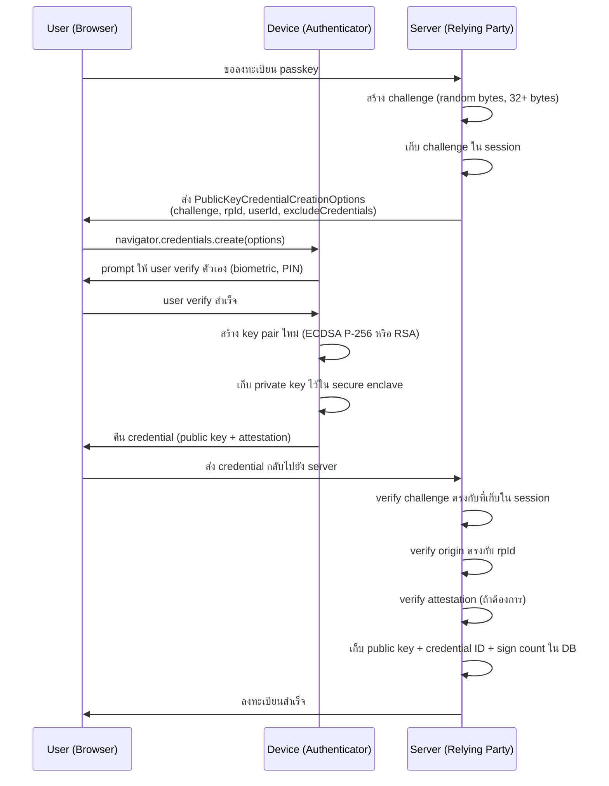
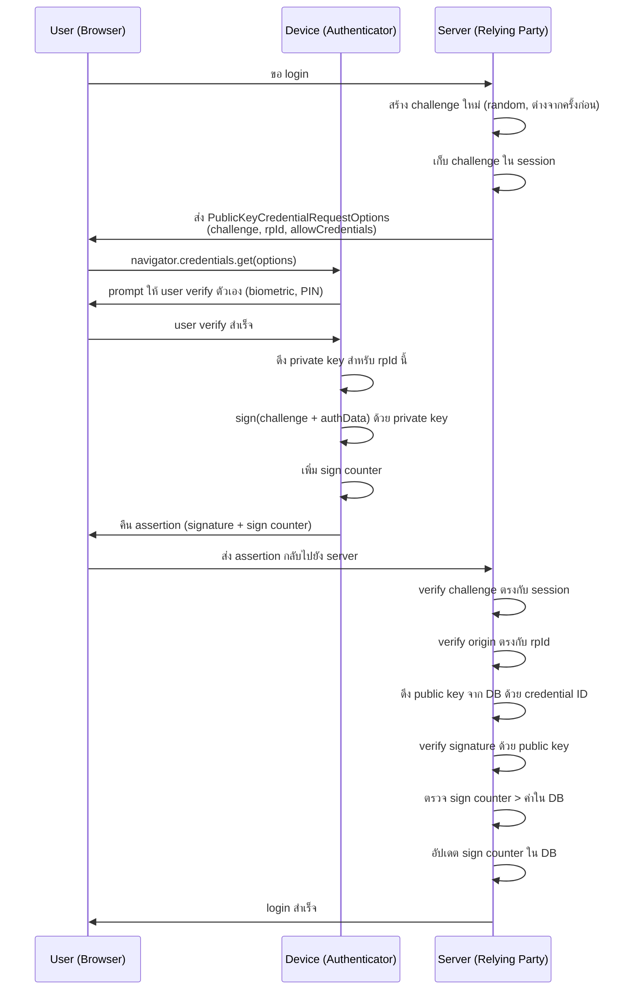

# Concept: WebAuthn / FIDO2 / Passkeys

## ชื่อเยอะ — ความสัมพันธ์กัน

คำเหล่านี้มักใช้สับสน แต่มีความสัมพันธ์ที่ชัดเจน:

| ชื่อ | คืออะไร |
|------|---------|
| **FIDO2** | มาตรฐานรวม = WebAuthn + CTAP2 — ออกโดย FIDO Alliance |
| **WebAuthn** | Web API spec (W3C) — JavaScript API ที่ browser expose ให้ website ใช้ |
| **CTAP2** | Client to Authenticator Protocol — วิธีที่ browser/OS คุยกับ hardware key |
| **Passkeys** | ชื่อ marketing ของ FIDO2 credential แบบ synced — Apple/Google/Microsoft ใช้คำนี้ |
| **Security Key** | hardware authenticator เช่น YubiKey — ใช้ CTAP2 |

**สรุปสั้น:** Passkeys = WebAuthn credential ที่ sync ข้าม device ได้ (ผ่าน iCloud, Google Password Manager)

## Key Insight: Public Key Cryptography

ความแตกต่างพื้นฐานจาก password:

```
Password:
  Registration:   User → "password123" → server เก็บ hash("password123")
  Login:          User ส่ง "password123" → server hash แล้วเทียบ
                  ↑ secret ส่งผ่าน network ทุกครั้ง → phishable, leakable

WebAuthn:
  Registration:   Device สร้าง key pair → device เก็บ private key → server เก็บ public key
  Login:          Server ส่ง challenge → device sign ด้วย private key → server verify ด้วย public key
                  ↑ private key ไม่เคยออกจาก device → ไม่มีอะไรส่งผ่าน network ที่ reuse ได้
```

server เก็บ **public key** — แม้ database รั่วก็ไม่มีใคร login ได้ เพราะ public key ไม่ใช่ secret

## Registration Flow



## Authentication Flow



## ทำไมถึง Phishing-Proof

นี่คือ feature ที่ทำให้ WebAuthn ต่างจาก TOTP และ SMS OTP อย่างสิ้นเชิง:

**Credential ผูกกับ `rpId` (Relying Party ID)**

`rpId` คือ domain ที่ลงทะเบียน เช่น `example.com`
เมื่อลงทะเบียนบน `example.com` → device สร้าง key pair ที่ใช้ได้แค่กับ `example.com`
ถ้า phishing site ใช้ domain `examp1e.com` → origin ต่างกัน → device ปฏิเสธทำ authentication

```
User ลงทะเบียนบน:     example.com  ← rpId = "example.com"
Phishing site ใช้:    examp1e.com  ← rpId ต่างกัน = credential ใช้ไม่ได้
```

**ไม่มี secret ที่ user "รู้" และส่งออกไป:**
- Password: user ส่ง secret → phishing site รับได้
- TOTP: user ส่ง code ที่ valid อยู่ 30 วินาที → phishing site relay ได้
- WebAuthn: device sign challenge ของ server จริงๆ เท่านั้น → phishing site ไม่มี challenge ที่ถูก origin

## Sign Counter — ป้องกัน Credential Cloning

แต่ละครั้งที่ authenticator sign → เพิ่ม counter ขึ้น 1
server เก็บ counter ล่าสุดไว้ และ verify ว่า counter ใหม่ > counter เดิม

**ทำไมสำคัญ:**
```
Sign Counter: ป้องกัน hardware key cloning
  ถ้า attacker copy private key ออกจาก YubiKey ได้ (ยาก แต่ทฤษฎีเป็นไปได้)
  แล้วใช้ key clone ทำ authentication:
  - Key จริง: sign counter = 50
  - Key clone (ถ้า clone ก่อน counter 50): sign counter = 49
  - Server เห็น counter 49 < 50 → รู้ว่ามี cloned credential → alert
```

**Passkeys และ sign counter:**
passkeys ที่ sync ผ่าน iCloud หรือ Google Password Manager อาจมี sign counter = 0 ตลอด (ไม่ increment)
เพราะการ sync ทำให้ยากที่จะ track counter ข้าม device
server ควร handle กรณีที่ counter = 0 แยกจาก "counter ลดลง"

```go
// Handle sign counter อย่างถูกต้อง
func verifySignCount(stored, new uint32) error {
    if new == 0 {
        // passkey ที่ sync — ไม่ใช้ counter, ข้ามการตรวจ
        return nil
    }
    if new <= stored {
        // counter ไม่เพิ่ม → อาจมี cloned credential
        return fmt.Errorf("sign counter regression: stored=%d, new=%d — possible credential clone", stored, new)
    }
    return nil
}
```

## Resident Keys vs Non-Resident Keys

**Non-Resident (Server-Side Credential):**
- server ส่ง `allowCredentials` list ให้ authenticator — บอกว่า "มี key อยู่ใน device มั้ย?"
- user ต้องพิมพ์ username ก่อน เพื่อให้ server รู้จะส่ง credential IDs อะไร
- เหมาะกับ: security keys ที่มีหน่วยความจำจำกัด

**Resident Key / Discoverable Credential:**
- device เก็บ credential metadata ไว้ในตัว — user ไม่ต้องพิมพ์ username
- server ส่ง `allowCredentials: []` (empty) → device แสดง passkeys ที่มีให้ user เลือก
- เหมาะกับ: passkeys บน phone (Touch ID, Face ID) — "Passwordless login"
- ใน WebAuthn spec เรียกว่า `requireResidentKey: true` หรือ `residentKey: "required"`

## Attestation — ตรวจสอบ Authenticator

Attestation คือ proof จาก manufacturer ว่า "credential นี้สร้างโดย authenticator ที่น่าเชื่อถือ"

**Attestation Formats:**
- `none` — ไม่มี attestation (ใช้บ่อยสุดสำหรับ consumer use case)
- `packed` — format ทั่วไปของ FIDO authenticator
- `tpm` — Windows Hello ที่ใช้ TPM chip
- `android-key` — Android device ที่ใช้ Android Keystore
- `apple` — Apple TouchID / FaceID

**เมื่อไหรต้องใช้ attestation:**
- ทั่วไป: ไม่จำเป็น — consumer app แทบไม่เคย verify attestation
- High-security: enterprise ที่ต้องการ verify ว่าใช้ hardware key จริง (ไม่ใช่ software authenticator)
- รัฐบาล / banking: บางกรณีต้องการ FIDO certified authenticator เท่านั้น

## Go Implementation Pattern

```go
import "github.com/go-webauthn/webauthn/webauthn"

// Initialize WebAuthn
wauthn, err := webauthn.New(&webauthn.Config{
    RPDisplayName: "My App",          // แสดงให้ user เห็นบน consent prompt
    RPID:          "example.com",     // domain — ต้องตรงกับ origin ของ web app
    RPOrigins:     []string{"https://example.com"},
})

// User ต้อง implement WebAuthnUser interface
type User struct {
    ID          []byte
    Name        string
    DisplayName string
    Credentials []webauthn.Credential
}

func (u *User) WebAuthnID() []byte                         { return u.ID }
func (u *User) WebAuthnName() string                       { return u.Name }
func (u *User) WebAuthnDisplayName() string                { return u.DisplayName }
func (u *User) WebAuthnCredentials() []webauthn.Credential { return u.Credentials }

// Registration
creation, sessionData, err := wauthn.BeginRegistration(user)
// เก็บ sessionData ใน server-side session
// ส่ง creation เป็น JSON ให้ browser

// หลังได้ response จาก browser
credential, err := wauthn.FinishRegistration(user, *sessionData, parsedResponse)
// เก็บ credential ใน DB

// Authentication
assertion, sessionData, err := wauthn.BeginLogin(user)
// เก็บ sessionData ใน server-side session
// ส่ง assertion เป็น JSON ให้ browser

// หลังได้ response จาก browser
credential, err := wauthn.FinishLogin(user, *sessionData, parsedResponse)
// ตรวจ sign counter และอัปเดตใน DB
```

## DB Schema สำหรับ Credentials

```sql
CREATE TABLE webauthn_credentials (
    id              BYTEA PRIMARY KEY,        -- credential ID (จาก authenticator)
    user_id         UUID NOT NULL,
    public_key      BYTEA NOT NULL,           -- CBOR-encoded public key
    sign_count      BIGINT NOT NULL DEFAULT 0,
    aaguid          UUID,                     -- Authenticator AAGUID (optional)
    created_at      TIMESTAMPTZ NOT NULL DEFAULT NOW(),
    last_used_at    TIMESTAMPTZ,
    FOREIGN KEY (user_id) REFERENCES users(id)
);

-- user มีได้หลาย credential (หลาย device)
CREATE INDEX idx_webauthn_credentials_user_id ON webauthn_credentials(user_id);
```

## Production Considerations

**Multiple credentials per user:**
user ควรลงทะเบียนหลาย device — ถ้า phone หาย จะ login ได้จาก laptop
UI ควรให้ user ตั้งชื่อ credential ("iPhone 14", "YubiKey ที่บ้าน") และลบได้

**Account Recovery:**
WebAuthn ไม่ได้แก้ปัญหา "ลืม authenticator" — ต้องมี fallback
- recovery codes (one-time use, เก็บที่ปลอดภัย)
- backup email verification
- support ขอ account recovery ด้วย identity verification

**Browser Support:**
WebAuthn รองรับทุก modern browser (Chrome 67+, Firefox 60+, Safari 13+, Edge 18+)
ตรวจสอบ support: `if (window.PublicKeyCredential) { ... }`

**Conditional UI (Passkey Autofill):**
browser ใหม่รองรับ passkey autofill ใน username field — user เห็น passkey suggestion โดยไม่ต้องกดปุ่มพิเศษ
ใช้ `navigator.credentials.get({ mediation: "conditional" })` บน frontend
